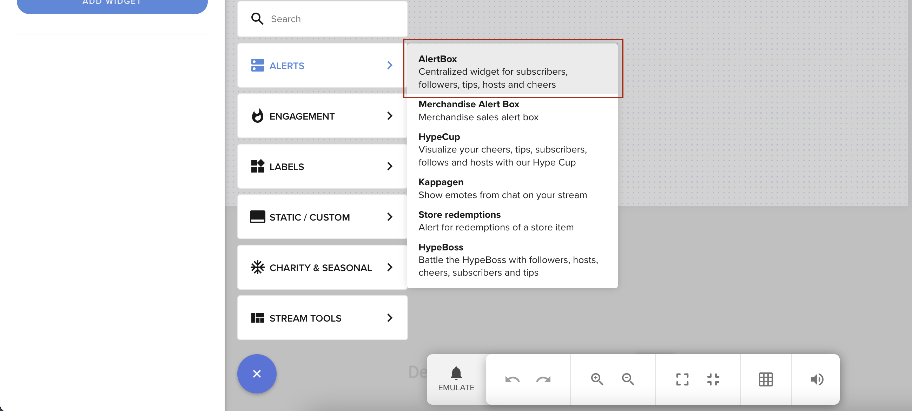
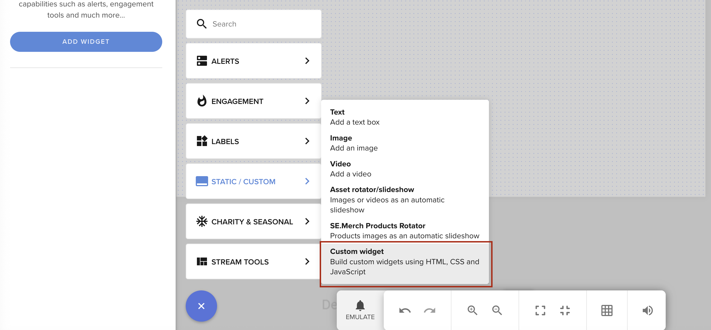

# Before Starting

Before Starting explains how to create a Custom Widget or Custom Code AlertBox, using StreamElements' the Overlay Editor UI.

We will start by creating an Overlay first and then the widgets, an AlertBox and a Custom Widget, which you'll be able edit.

## Creating an Overlay

Navigate to the [Overlays](https://streamelements.com/dashboard/overlays) section and click the **NEW OVERLAY** button.

  

Next you'll neeed to pick your resolution and click the **START** button.

> Overlay size: Usually it should match your stream's resolution, or be smaller than it  - if you'd like to do the repositioning in your broadcasting software.

## AlertBox

The AlertBox is a native widget that displays live events from the queue in a popup-like behavior.

To create an AlertBox:

1. Click the **+** button in overlay editor
  

2. Select **AlertBox** in the **ALERTS** section
  

### Enabling Custom code for AlertBox

You can enable custom code for AlertBox by toggling the "Enable custom CSS" option for alert type you want to use.
For example open options for AlertBox, go to "Followers" tab and enable custom code as on screenshot below

## Custom Widget
The Custom Widget is a native widget that you can use to display any content you want.
It is a good way to display your own content in overlay. It can consume local events (like tips, follows etc.) as well
as remote events read from a websocket or from a REST API.

To create a Custom Widget:

1. Click the **+** button in overlay editor
  

2. Select **Custom Widget** in the **STATIC/CUSTOM** section
  

